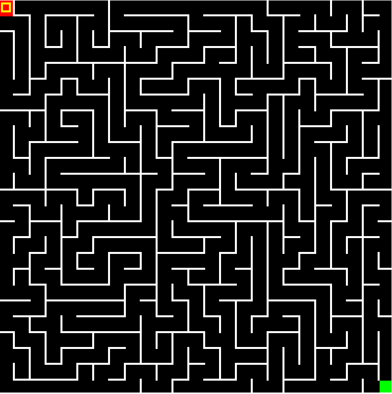
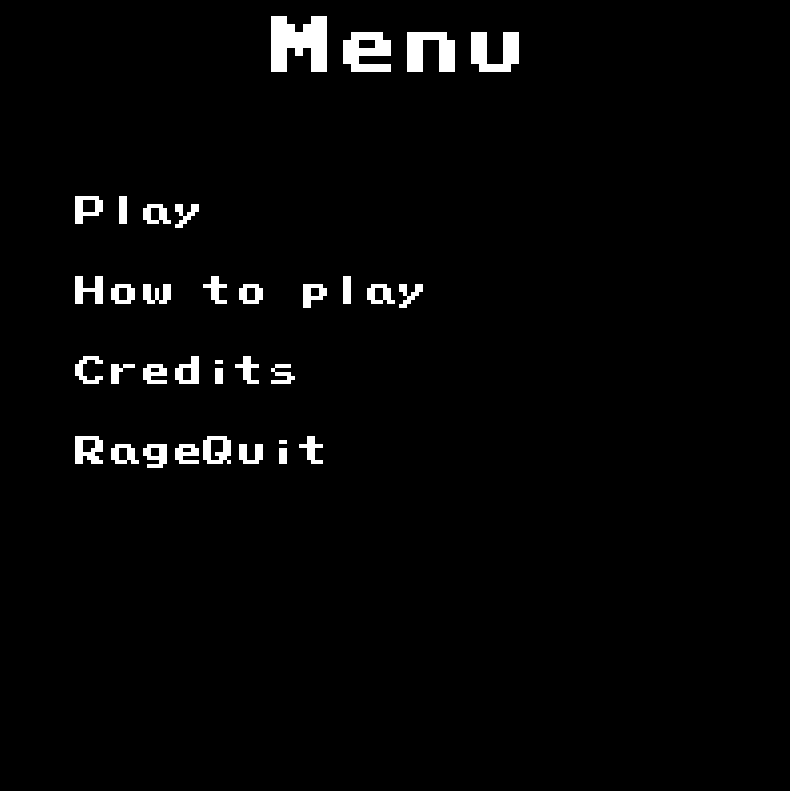

<h1 align="center">
  
</h1>

  Please Compile

 

 

Table of Contents

- [About](#about)
  - [Built With](#built-with)
- [Getting Started](#getting-started)
  - [Prerequisites](#prerequisites)
  - [Installation](#installation)
- [Usage](#usage)
- [Support](#support)
- [Project assistance](#project-assistance)
- [Contributing](#contributing)
- [Authors & contributors](#authors--contributors)
- [Security](#security)
- [License](#license)

---

## About

<table><tr><td>

> Just a Maze Game.
> And the whole purpose of it is to have fun.

Screenshots

 

|                               The Game                               |                               Game over                                |
| :-------------------------------------------------------------------: | :--------------------------------------------------------------------: |
|  |  |

</td></tr></table>

### Built With

> Visual Studio, GitHub, PhotoShop, Microsoft Office

## Getting Started

### Prerequisites

> We wanted to create an interesting maze game.

### Installation

> In order to install our game you will need to download the .exe file and run it.

## Usage

> You move the player with the W A S D keys.
> Provide various use cases and code examples here.

## Support

> You can always contact us on discord - 𝓔𝓰𝓸𝓻#6969.

## Project assistance

If you want to say **thank you** or/and support active development of Please Compile:

- Add a [GitHub Star](https://github.com/NDDimitrov19/PleaseCompile) to the project.
- Tweet about the Please Compile.
- Write interesting articles about the project on [Dev.to](https://dev.to/), [Medium](https://medium.com/) or your personal blog.

Together, we can make Maze Game **better**!

## Contributing

First off, thanks for taking the time to contribute! Contributions are what make the open-source community such an amazing place to learn, inspire, and create. Any contributions you make will benefit everybody else and are **greatly appreciated**.

## Authors & contributors

The original setup of this repository is by [Nikolai Dimitrov](https://github.com/NDDimitrov19).

For a full list of all authors and contributors, see [the contributors page](https://github.com/NDDimitrov19/PleaseCompile/contributors).

## Security

Please Compile follows good practices of security, but 100% security cannot be assured.
Please Compile is provided **"as is"** without any **warranty**. Use at your own risk.

_For more information and to report security issues, please refer to our [security documentation](docs/SECURITY.md)._

## License

This project is licensed under the **GNU General Public License v3**.

See [LICENSE](LICENSE) for more information.
